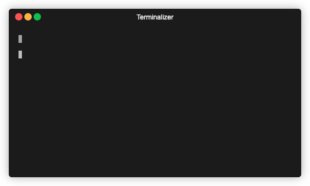
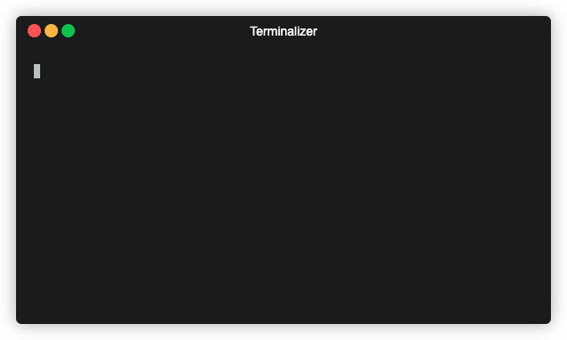

# np issue - aborting np returns 0 status code

1. Run `npm run release`
2. Prompt choose version appears
3. Press <Ctrl+C>
4. Howdy

* npm `release` script executes `np`
* npm `postrelease` hook should be invoked when `release` exits with status 0

This happens only on my Mac (macOS Mojave 10.14.6) with node v11.15.0

Tested also on Windows 10 Home 64 with node v11.15.0 and issue was not reproduced

---

It appears that this issue happens only in the version selection screen.
When prompted with _"No commits found since previous release, continue?"_
Pressing <Ctrl+C> exits with non-zero status code thus the `postrelease` hook
is not invoked.

